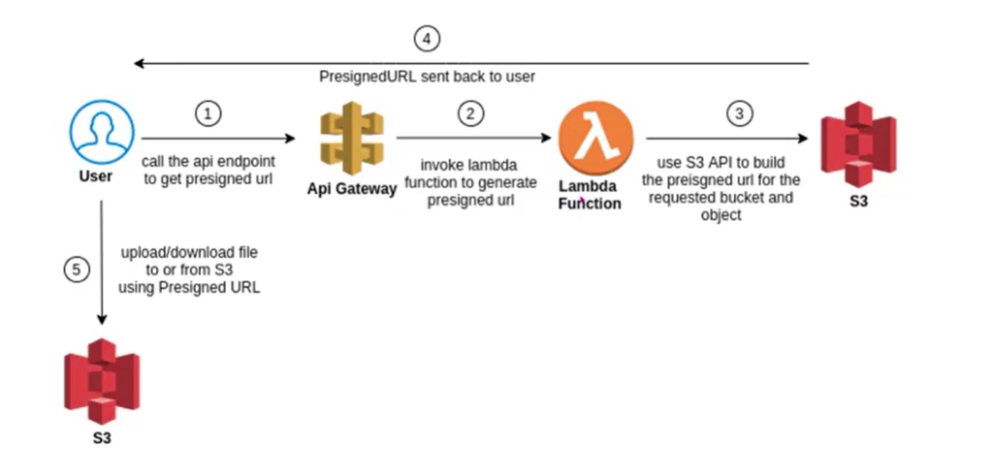

# Secure File Upload System using Pre-Signed URLs

This project demonstrates a secure file upload architecture using:
- Amazon API Gateway
- AWS Lambda
- Amazon S3

## Architecture

### Infrastructure Diagram:

<p align="center">
  
</p>


Client → API Gateway → Lambda → S3 (Generate Pre-Signed URL)  
Client → S3 (Upload using Pre-Signed URL)

## Features
- Secure upload without exposing credentials
- Pre-signed URL with expiry
- Serverless and scalable

## Setup

### 1. Create S3 Bucket
- Create bucket: my-presigned-bucket-demo
- Disable public access
- Add CORS:
```
[
  {
    "AllowedHeaders": ["*"],
    "AllowedMethods": ["GET", "PUT"],
    "AllowedOrigins": ["*"]
  }
]
```
### 2. IAM Policy
```
{
  "Version": "2012-10-17",
  "Statement": [
    {
      "Effect": "Allow",
      "Action": ["s3:PutObject", "s3:GetObject"],
      "Resource": "arn:aws:s3:::my-presigned-bucket-demo/*"
    }
  ]
}
```

### 3. Lambda Code (Python)

### 4. API Gateway
- Create HTTP API
- Route: GET /generate-url
- Integrate Lambda

## Testing

Step 1:

`curl "API_URL/generate-url"`

Step 2:

`curl -X PUT -T test.txt "UPLOAD_URL"`

#Bash

```
UPLOAD_URL=$(curl -s "https://API_URL/generate-url" | jq -r .uploadUrl)
curl -X PUT -T test.txt "$UPLOAD_URL"

```


## Notes
- Do not modify pre-signed URL
- Ensure correct headers
- URL expires in 5 minutes

## Troubleshooting
- SignatureDoesNotMatch → method/header mismatch
- AccessDenied → IAM or bucket policy
- InvalidAccessKeyId → AWS CLI issue
